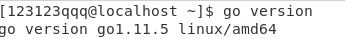
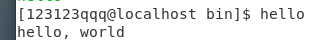
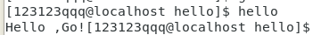
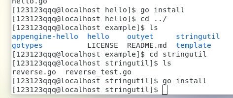

# Go开发环境安装

#### 开发环境：CentOS7

## 安装VSCode编辑器


VSCode的下载安装很简单，直接去[官网](https://code.visualstudio.com/)下载，然后双击安装即可，启动VSCode输入命令`code`即可。

## 安装golang

### 安装

这一步在课程主页上给的很详细，我们只要照本宣科即可，输入命令：

```
sudo yum install golang
rpm -ql golang |more
go version
```

如果看到类似



则说明操作成功！

### 设置环境变量

输入命令

```
mkdir $HOME/gowork
export GOPATH=$HOME/gowork
export PATH=$PATH:$GOPATH/bin
source $HOME/.profile
go env
```

然后观察GOPATH和GOROOT项是否符合预期。

解释：这里的GOPATH其实就是工作空间，以后Go语言的编写的源代码和可执行文件都会分别放在其下的src文件夹和bin文件夹，易于管理。

## 创建hello world!

创建第一个包

```
mkdir $GOPATH/src/github.com/github-user/hello -p
```

在**$GOPATH/src/github.com/github-user/hello**下创建hello.go，内容为：

```
package main

import "fmt"

func main() {
    fmt.Printf("hello, world\n")
}
```

然后用go工具来构建安装此程序

```
go install github.com/user/hello
```

此时可在bin目录下发现hello可执行文件

输入hello即可输出hello,world! 说明测试通过。



## 可选博客：使用git进行操作

由于我的CentOS自带了git所以不再重装。

我们先在github上创建相应仓库获取https：https://github.com/SYSUYZT/Golang.git

然后在虚拟机本地创建一个空文件夹，使用`git init`来初始化仓库，然后往里面放README.md，我们就可以使用`git add README.md`和`git commit -m"First Commit"`来提交修改了，然后我们要与远程仓库绑定`git remote add origin https://github.com/SYSUYZT/Golang.git `即可，然后我们进行第一次`git push-u origin master`，可能需要输入用户密码。待上传完成即可，以后每次的操作只用遵循add, commit, push的顺序即可。

## 第一个库
我们根据网站指南进行操作
```
mkdir $GOPATH/src/github.com/github-user/stringutil
```
编写reverse.go文件
```
package stringutil

func Reverse(s string) string {
	r := []rune(s)
	for i, j := 0, len(r)-1; i < len(r)/2; i, j = i+1, j-1 {
		r[i], r[j] = r[j], r[i]
	}
	return string(r)
}
```
然后使用在其目录下使用`go install`，即可在pkg中见到相应的包，我们修改hello.go
```
package main

import (
	"fmt"

	"github.com/user/stringutil"
)

func main() {
	fmt.Printf(stringutil.Reverse("!oG ,olleH"))
}
```
然后再重新安装hello，运行得到结果


## 测试
我们根据指南编写测试程序
```

package stringutil

import "testing"

func TestReverse(t *testing.T) {
	cases := []struct {
		in, want string
	}{
		{"Hello, world", "dlrow ,olleH"},
		{"Hello, 世界", "界世 ,olleH"},
		{"", ""},
	}
	for _, c := range cases {
		got := Reverse(c.in)
		if got != c.want {
			t.Errorf("Reverse(%q) == %q, want %q", c.in, got, c.want)
		}
	}
}
```
在其目录下使用`go test`指令，得到结果


## 远程包
这里网站指南有错，如果直接用`go get`指令并不会改变工作空间的目录结构，go会直接从远端获得程序，我们应该使用`go install`以改变目录结构。


